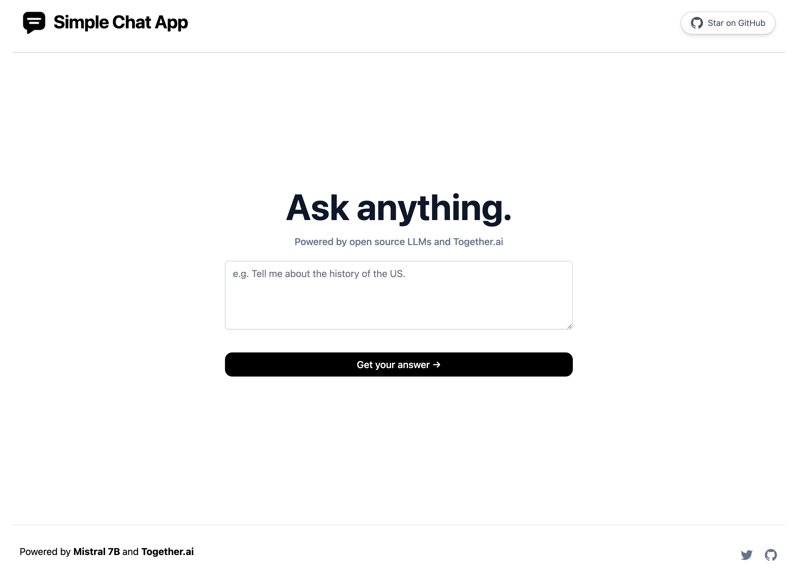

# Chat app

A simple Next.js chat app that uses Mixtral MOE through Together.ai. It shows off how to do streaming with open source LLMs using Next.js and Together.ai.

[](https://simple-ai-chat.vercel.app)

## How it works

This project uses Mixtral MOE through [Together.ai's serverless endpoints](https://docs.together.ai/docs/inference-models) and [Vercel Edge functions](https://vercel.com/features/edge-functions) with streaming. It takes the prompt the user specifies, sends it to Mixtral MOE via a Together serverless endpoint, then streams the response back to the application.

## Running Locally

After cloning the repo, go to [Together.ai](https://together.ai) to make an account and put your API key in a file called `.env`.

Then, run the application in the command line and it will be available at `http://localhost:3000`.

```bash
npm run dev
```

# Version 2 (future)

For version 2 of this app, here are some features I want to add:

- [ ] Auth with Clerk.
- [ ] Header with profile pic + name + clone github on the right. On the left, select item to pick what model to use (mistral, Llama, ect...).
- [ ] Share and Rewrite buttons like Perplexity.
- [ ] No sidebar. Just chatbox on the bottom similar to chatGPT or Pi with a disclaimer.
- [ ] Search by pressing enter in the text box.
- [ ] Migrate app to the Next.js app router.
- [ ] Make sure the app scrolls as the text comes in.
- [ ] End-to-end encryption: Enhance the security by implementing end-to-end encryption.

Get inspo from:

- https://chat.openai.com/
- https://chat.vercel.ai/
- https://www.perplexity.ai/
- https://pi.ai/talk
- https://poe.com/
- https://claude.ai/chats
